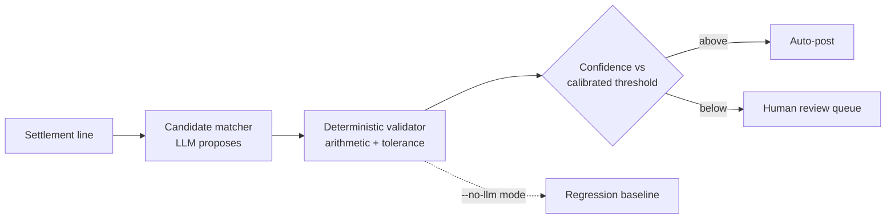

<!--
  REMAINING: replace REPO_LINK_FINANCE and REPO_LINK_RFP with real repo URLs,
  fill in the demo credentials line under the Salesforce project,
  and confirm the three /assets GIF filenames match exactly (case-sensitive).
  Then delete this comment.
-->

  

  
  
  
  

---

I build LLM systems that come with a measurement attached: agentic workflows, retrieval over domain documents, and natural-language-to-query generation.

## About Me

Final-year CS undergrad at G.L. Bajaj Institute of Technology and Management (2027, 8.1 CGPA), based in Greater Noida.

I got into AI engineering through the failure modes rather than the capabilities. An agent that reconciles invoices is easy to write and hard to trust, and almost all the interesting work lives in the second part: deciding what the model is allowed to touch, what gets checked deterministically, and what number you'd defend if someone asked how you know it works.

In practice that means I write the evaluation harness before the agent, keep arithmetic and hard constraints outside the model, and report precision separately from coverage. 350+ DSA problems solved along the way, mostly for the fluency.

## What I Build

- Agentic workflows where tool calls are validated rather than trusted
- Retrieval over real domain documents (tenders, financial records) instead of generic corpora
- Natural language to structured query, grounded in live schema
- Evaluation harnesses: planted ground truth, calibration tables, deterministic regression baselines
- Guardrails for untrusted input, including prompt injection carried inside user-supplied documents
- FastAPI services with PostgreSQL and pgvector underneath

---

## Featured Projects

### AI Finance Controller — Agentic Invoice Reconciliation

  

Reconciles settlement lines against ledger entries, posts the entries, and reports the cash position. It decides which matches are safe to auto-post and which go to review. Built for the Razorpay Buildathon (Track 04).

**The problem worth solving.** You can't evaluate a reconciliation agent against real books, because nobody knows the right answer in advance. So I generated the dataset with planted ground truth before the agent existed. That turned "it seems to work" into a number I could actually move.

**Result.** 98.3% match rate at 100% precision, reported separately, because a system that matches everything and is occasionally wrong is worse than one that abstains.

<b>Architecture and evaluation methodology</b>

 

The model proposes candidate matches and never computes an amount. Arithmetic and tolerance checks run in deterministic Python, and a `--no-llm` mode executes the full pipeline with the model removed entirely, which doubles as a regression baseline.

The auto-post confidence threshold is derived from a calibration table rather than picked. CI enforces module layering so the matching layer cannot import adjudication, keeping verification independent of the code that produces the candidates.

The repo documents one genuine unresolved miss instead of tuning it away.

`Python` · `FastAPI` · `PostgreSQL` · `Claude API` · `pytest`

→ **[Live demo](https://ai-finance-controller-beta.vercel.app/)** · **[Repository](REPO_LINK_FINANCE)**

 

### Salesforce NL→SOQL Dashboard

  

Turns plain-English business questions into validated SOQL and renders the answer as a live dashboard widget, so non-technical teams stop queueing behind an analyst.

**The problem worth solving.** An LLM will confidently invent a field name that sounds correct. Against a live Salesforce org that's either an API error or, worse, a query that executes and returns something quietly misleading.

<b>How the validation loop works</b>

 

The agent fetches live org metadata and generates SOQL constrained to fields that actually exist. A validation layer checks every generated query against that schema and blocks malformed or unsafe ones before execution.

On failure, the parse error is fed back for a bounded retry, so a bad first attempt self-corrects rather than surfacing as an error. Results render as tables and charts, sub-10 seconds end to end.

`Python` · `FastAPI` · `React` · `Salesforce SOQL` · `Claude API`

→ **[Live demo](https://salesforce-report-dashboard-d3bu.vercel.app/)** · **[Repository](https://github.com/abhay04yadav/Salesforce-Report-Dashboard)**

> Demo login: `ADD_DEMO_EMAIL` / `ADD_DEMO_PASSWORD`

 

### RFP Compliance Agent — Tender Obligation Extraction

  

Reads 96-page government tenders and extracts the obligations a bid is actually bound by.

**The problem worth solving.** Compliance language is adversarial by accident. "Shall" and "must" bind you; "may" and "desirable" carry no weight. And a single requirement is routinely split across sections, with the clause in one table and its numeric threshold in another, joined on bidder tier.

<b>Routing, retrieval, and threat model</b>

 

Numeric constraints (turnover, headcount, project value) route to deterministic checks. Only genuinely ambiguous qualitative clauses reach the model, so invocations scale with ambiguity rather than document length.

Retrieval runs over pgvector, with MCP handling tool access. Tender PDFs are treated as untrusted input, because a document you didn't write is a prompt-injection surface.

The headline metric is false-compliance rate rather than accuracy, since one wrongly-cleared gap disqualifies an entire bid.

`Python` · `FastAPI` · `pgvector` · `MCP` · `Claude API`

→ **[Repository](REPO_LINK_RFP)**

---

## Engineering Philosophy

**Evaluate before optimizing.** Without a harness there's no improvement, only vibes. I build the measurement first, even though it's the boring part.

**Keep deterministic logic out of the model.** LLMs are good at ambiguity and bad at arithmetic. Anything with a single right answer gets computed in code.

**Validate outputs instead of trusting them.** Generated queries are checked against real schema before execution. A model's confidence is an input to a decision, not the decision.

**Ground generation in something real.** Live metadata, actual document text, an existing table. Retrieval that isn't anchored is just an expensive way to hallucinate.

**Treat external input as hostile.** Any document a user uploads is untrusted, and any text the model reads from it can carry instructions.

**Prefer measurable behaviour over impressive demos.** A demo that worked once tells you nothing. I'd rather publish a documented failure than quietly tune it away.

---

## Tech Stack

  

| | |
|---|---|
| **Languages** | Python, SQL, SOQL, JavaScript |
| **AI / LLM** | LLM agents, RAG, MCP, tool calling, prompt engineering, embeddings, evaluation & benchmarking |
| **Backend** | FastAPI, PostgreSQL, pgvector, REST APIs |
| **Tooling** | Docker, Git, GitHub Actions, pytest, React |

---

## Currently Building / Learning

Going deeper on evaluation for agentic systems, which is still mostly ad hoc across the field. Two questions I keep running into: how do you attribute a failure when it could have occurred at any step of a multi-step agent, and what does a useful regression suite look like when the model itself is nondeterministic?

Alongside that, more time with MCP past the basics, and reading on calibration and abstention. When should a system decline to answer instead of answering confidently?

---

## GitHub

  <picture>
    <source media="(prefers-color-scheme: dark)" srcset="https://github-readme-stats.vercel.app/api?username=abhay04yadav&show_icons=true&hide_border=true&hide=issues&theme=github_dark" />
    
  </picture>
  

  

---

## Contact

  <a href="https://github.com/abhay04yadav">GitHub</a> ·
  <a href="https://linkedin.com/in/abhay04yadav">LinkedIn</a> ·
  <a href="mailto:abhayyadav.dev@gmail.com">abhayyadav.dev@gmail.com</a>

  Open to AI / GenAI engineering internships and entry-level roles.

